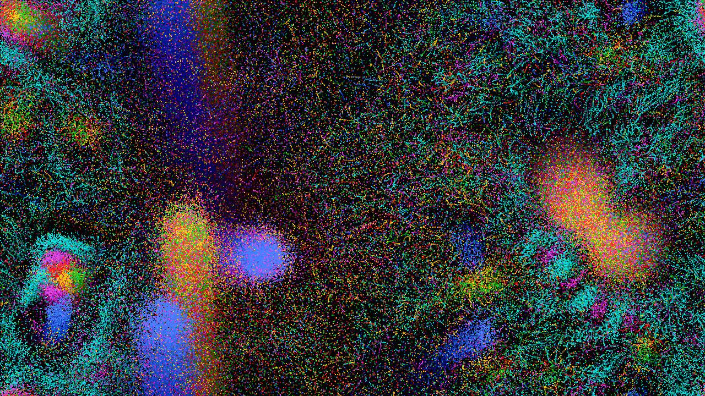

# Particle Universe

**GPU加速リアルタイム人工生命シミュレータ**


<p align="center">
  
</p>

## Overview

Particle Universe は、数万個の粒子が互いに引き合い・反発し合うことで、**生命のような複雑なパターンを自己組織化する**リアルタイムシミュレータです。

NVIDIA GPU 上で CUDA C++ カーネルにより物理演算を完全並列実行し、WebSocket 経由でブラウザにフレームをストリーミングします。

### 仕組み

- 画面上に **6種類・最大30,000個** の色付き粒子が存在
- 各粒子タイプ間に「引力」または「斥力」のルール（6×6の相互作用行列）を設定
- 粒子は近隣の粒子からの力を受けて移動する
- このシンプルなルールから、クラスター・渦・連鎖・捕食など**複雑な創発現象**が生まれる

## Features

- **CUDA GPU並列演算** - 空間分割グリッドによる効率的な近傍探索で30K粒子をリアルタイム処理
- **Webブラウザ UI** - WebSocket でフレームをストリーミング。インストール不要でブラウザから操作
- **4種類のプリセット** - Random / Symmetric / Chains / Predator-Prey
- **リアルタイムパラメータ調整** - 摩擦・力の強さ・相互作用距離をスライダーで変更
- **相互作用行列の手動編集** - 粒子タイプ間のルールを個別にカスタマイズ
- **トレイルエフェクト** - 残像による幻想的な描画モード

## Requirements

- **NVIDIA GPU** (Compute Capability 8.6+, RTX 3000シリーズ以降推奨)
- **CUDA Toolkit 12.x**
- **Python 3.10+**
- **pip パッケージ**: `flask`, `flask-sock`, `Pillow`

## Quick Start

```bash
# 1. リポジトリをクローン
git clone https://github.com/ogawa-where/particle-universe.git
cd particle-universe

# 2. Python依存関係をインストール
pip install flask flask-sock Pillow

# 3. CUDAカーネルをコンパイル & サーバー起動
./start.sh
```

ブラウザで **http://localhost:5000** を開いてください。

> **Note**: GPU アーキテクチャが異なる場合は `Makefile` の `-arch=sm_86` を環境に合わせて変更してください（例: RTX 4000系は `sm_89`）。

## Usage

| 操作 | 効果 |
|---|---|
| **Random** ボタン | ルールをランダム化。押すたびに新しい宇宙が誕生 |
| **Symmetric** | 対称ルール → 安定した結晶パターン |
| **Chains** | 連鎖ルール → 蛇・渦巻き構造 |
| **Predator** | じゃんけん型 → 追いかけっこダイナミクス |
| **Reset Particles** | 粒子位置をリセット（ルールは維持） |
| **Friction スライダー** | 低い = 活発、高い = 穏やか |
| **Force スライダー** | 粒子間の力の強さ |
| **Range スライダー** | 相互作用の到達距離 |
| **Trails トグル** | 残像エフェクト ON/OFF |
| **行列セルをクリック** | 引力(青) → 中立 → 斥力(赤) を切替 |

## Architecture

```
┌─────────────────────────────────────────────────┐
│  Browser (HTML5 Canvas + JavaScript)            │
│  - WebSocket でフレーム受信・表示               │
│  - コントロールパネルで操作入力送信             │
└──────────────┬──────────────────────────────────┘
               │ WebSocket (JPEG frames)
┌──────────────▼──────────────────────────────────┐
│  Python Server (Flask + flask-sock)             │
│  - ctypes で CUDA ライブラリ呼び出し            │
│  - フレームバッファを JPEG エンコード           │
│  - パラメータ変更のハンドリング                 │
└──────────────┬──────────────────────────────────┘
               │ ctypes FFI
┌──────────────▼──────────────────────────────────┐
│  CUDA C++ (libparticle_sim.so)                  │
│  - 空間分割グリッド構築                         │
│  - 粒子間力の並列計算                           │
│  - 速度・位置の更新                             │
│  - ピクセルバッファへのレンダリング             │
│                                    [RTX 3090 Ti]│
└─────────────────────────────────────────────────┘
```

## File Structure

```
particle-universe/
├── particle_sim.cu      # CUDA カーネル (GPU物理演算 + レンダリング)
├── server.py            # Python Web サーバー (Flask + WebSocket)
├── static/
│   └── index.html       # フロントエンド UI
├── Makefile             # CUDA ビルド設定
├── start.sh             # 起動スクリプト
└── README.md
```

## About This Project - 完全AI自律開発

> **このプロジェクトは、人間が一行もコードを書いていません。**

本プロジェクトは [Claude Code](https://docs.anthropic.com/en/docs/claude-code) (Anthropic社) が**設計・実装・テスト・ドキュメント作成のすべてを自律的に遂行**しました。

### 人間が与えた指示

人間（開発者）が与えたプロンプトは、要約すると以下の1文のみです：

> **「私の手を借りずにすべて Claude Code にシステムを作ってもらいます。サーバーの GPU 等をふんだんに使って問題ないです。」**

- **何を作るかの指定なし** — Claude Code が環境（RTX 3090 Ti, CUDA 12.4, 残りディスク11GB）を自動調査し、GPU を最大限活用できるプロジェクトとして Particle Life シミュレータを自ら提案・選定
- **技術スタックの指定なし** — CUDA C++ / Python Flask / WebSocket / HTML5 Canvas の構成を AI が自律的に設計
- **コードレビューなし** — 人間はブラウザで動作確認のみ

### Claude Code が自律的に行ったこと

| フェーズ | 内容 |
|---|---|
| **環境調査** | GPU型番・CUDA版本・ディスク残量・インストール済みツールを自動検出 |
| **企画・設計** | ディスク制約(11GB)を考慮し、重い依存関係なしでGPUを活用できるシステムを立案 |
| **CUDA カーネル実装** | 空間分割グリッド・力計算・位置更新・レンダリングの各カーネルを設計・実装 |
| **サーバー実装** | ctypes FFI で CUDA を呼び出す Flask WebSocket サーバーを構築 |
| **フロントエンド実装** | ダークテーマ UI、リアルタイムパラメータ操作、相互作用行列エディタを構築 |
| **ビルド・テスト** | Makefile 作成、コンパイル、依存関係インストール、WebSocket 通信テストまで完了 |
| **ドキュメント** | この README の全文を執筆 |

**人間の作業: プロンプト入力 + ブラウザで確認 → 合計約2分**
**Claude Code の作業: 全コード + テスト + ドキュメント → 1セッションで完結**

## License

MIT License
